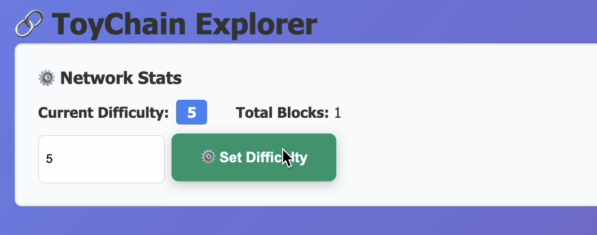
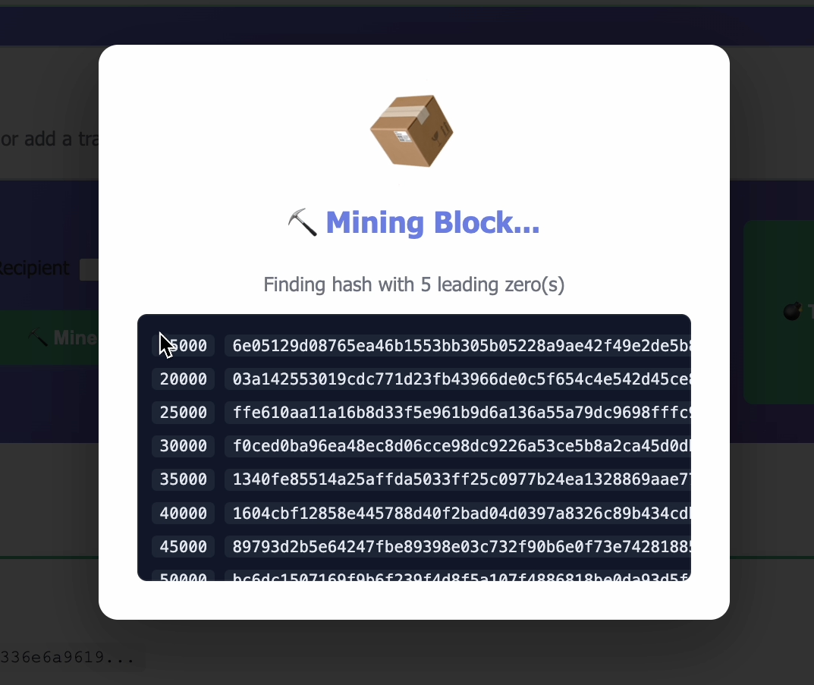
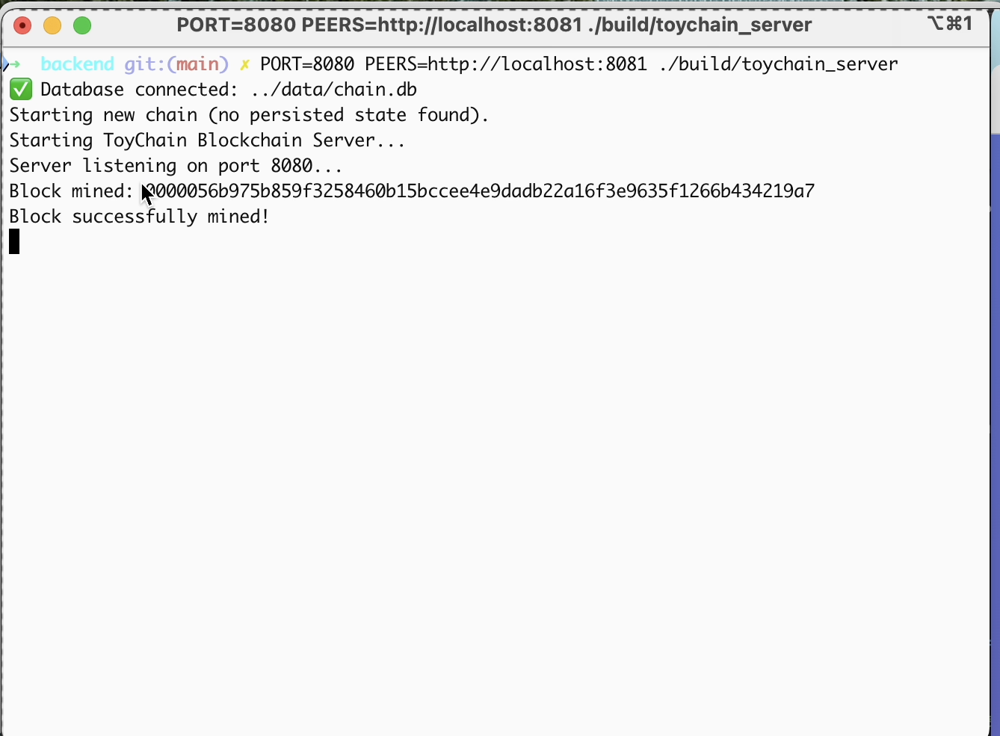
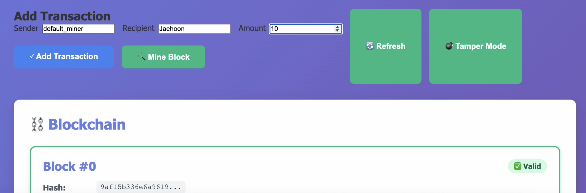
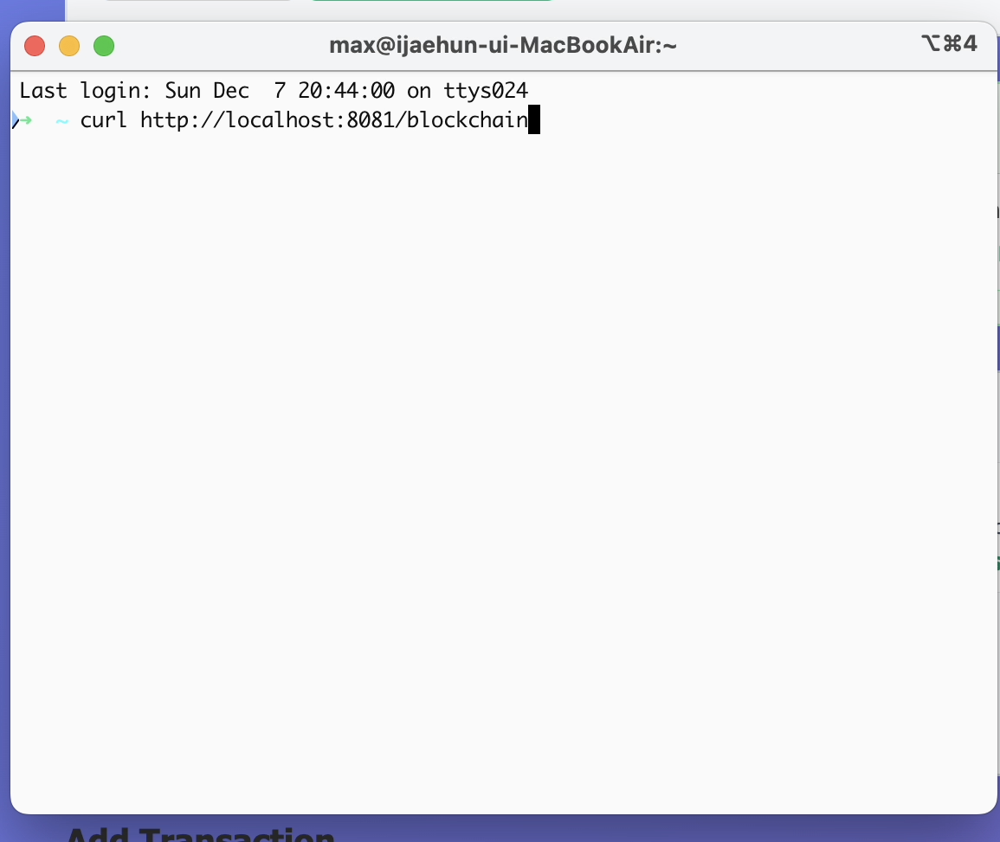
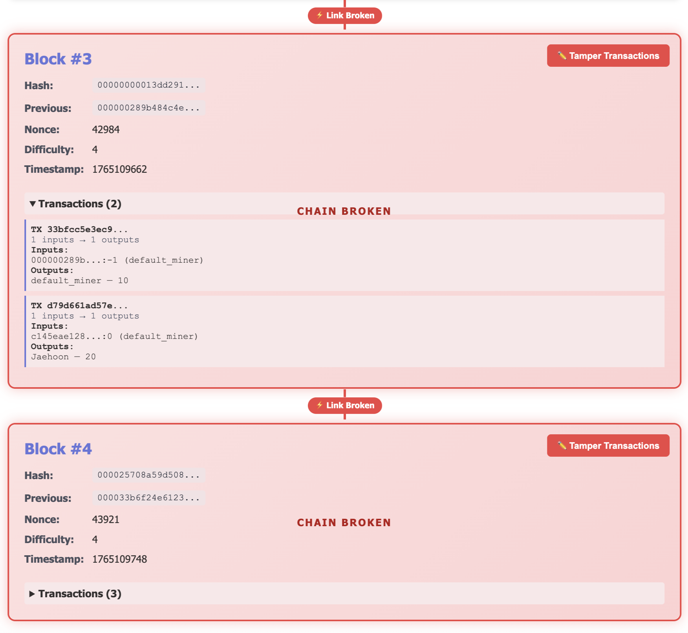

# What and Why Blockchain?

블록체인을 직접 설계·구현하면서 **“왜 블록체인이 가치가 있는 화폐가 될 수 있는가?”** 를 이해하는 프로젝트입니다.
백엔드(C++17) + 프런트(React)로 구성되며, 두 노드 간 P2P 전파를 시각적으로 확인할 수 있도록 구현했습니다.
직접 만들어보며 블록체인이 어떻게 구성되고, 왜 탈중앙이 가치가 생기는지를 경험하는 과정입니다.

## 목표

- 블록·트랜잭션·UTXO 구조를 직접 다뤄보며 블록체인의 핵심 개념 이해
- 두 노드(8080/8081) 사이 블록 전파를 통해 “탈중앙 동기화”를 체험
- 왜 블록체인이 주목받는지(검열 저항, 중단 저항, 신뢰 최소화 등) 감 잡기

## 실행 화면

📌 프런트엔드 메인 화면  
(트랜잭션 생성 / 블록 상태 확인)

<p align="center">
  <br>
  <em>프런트 메인 화면</em>
</p>

---

📌 채굴 난이도 설정

<p align="center">
  <br>
  <em>채굴 난이도 설정 화면</em>
</p>

---

📌 블록 채굴 시

<p align="center">
  <br>
  <em>블록 채굴 진행 중 (nonce 탐색 중)</em>
</p>

---

📌 블록 채굴 후

<p align="center">
  <br>
  <em>채굴 완료 — 새로운 블록 생성</em>
</p>

<p align="center">
  <br>
  <em>블록이 체인에 추가된 모습</em>
</p>

<p align="center">
  <br>
  <em>8080 노드에서 채굴된 블록 로그</em>
</p>

---

📌 트랜잭션 추가

<p align="center">
  <br>
  <em>트랜잭션 추가 전 상태</em>
</p>

---

📌 트랜잭션 추가 후 및 블록 채굴

<p align="center">
  <br>
  <em>트랜잭션 제출 화면</em>
</p>

<p align="center">
  <br>
  <em>트랜잭션 반영 후 채굴된 블록</em>
</p>

---

📌 두 노드 실행 모습  
(8080 / 8081 로그 비교)

<p align="center">
  <br>
  <em>8080 노드 서버 로그</em>
</p>

<p align="center">
  <br>
  <em>8081 노드 블록체인 조회(curl)</em>
</p>

<p align="center">
  <br>
  <em>8081 노드 블록 뷰</em>
</p>

📌 블록 브레이크 시

<p align="center">
  <a href="image/break.mp4">
    <br>
    <em>블록 브레이크 데모 영상 보기</em>
  </a>
</p>

## 실행 방법

필수: CMake, Node/NPM  
데이터 초기화(선택): `rm toychain/data/chain.db toychain/data/chain.dat`

1. 백엔드 빌드  
   `cd toychain/backend && cmake --build build`
2. 노드 실행(터미널 2개)
   - `PORT=8080 PEERS=http://localhost:8081 ./build/toychain_server`
   - `PORT=8081 PEERS=http://localhost:8080 ./build/toychain_server`
3. 프런트 실행  
   `cd toychain/frontend && npm install && npm run dev`  
   노드별 분리 뷰는 `VITE_API_A`/`VITE_API_B`로 설정(예: 8080/8081).
## 🔒 Why Blockchain Matters

(왜 블록체인이 가치 있고, 왜 안전하게 사용될 수 있는가?)

이 프로젝트는 블록체인의 핵심 개념을 직접 구현하여,
블록체인이 왜 “가치 있는 디지털 화폐 기반 기술”이 될 수 있는지를 이해하는 데 초점을 맞추고 있습니다.

### 1️⃣ 블록체인은 ‘변조가 사실상 불가능한 데이터 구조’입니다

블록체인은 블록(Block)들이 체인(Chain) 형태로 연결된 구조입니다.  
각 블록은 다음과 같은 특징을 가집니다:

- 이전 블록의 해시(`prev_hash`)를 포함합니다.  
- 현재 블록의 데이터(transactions, nonce, timestamp 등)를 기반으로 새로운 해시가 생성됩니다.  
- 블록 내부 값이 하나라도 변경되면 해시가 완전히 달라집니다.

즉, **블록 하나만 수정해도 그 이후의 모든 블록이 무효화됩니다.**

```cpp
std::string Block::computeHash() const {
    std::stringstream ss;
    ss << prev_hash << timestamp << nonce << difficulty;
    for (const auto &tx : transactions) ss << tx.toString();
    return sha256(ss.str());
}
위와 같이 블록 전체 내용을 직렬화한 뒤 SHA-256 해시를 생성하는 방식이기 때문에,
블록의 내용이 조금이라도 달라지면 해시가 전혀 다른 값이 되어 체인이 끊어지게 됩니다.
이러한 구조 덕분에 블록체인은 조작이 매우 어렵습니다.
### 2️⃣ 작업증명(PoW)으로 인해 조작 비용이 ‘현실적으로 불가능’해진다

본 프로젝트에서는 채굴 과정에서 블록 해시가 특정 난이도 조건을 만족해야만 블록이 생성되도록 구현되어 있습니다.
```cpp
while (true) {
    hash = computeHash();
    if (hash.substr(0, difficulty) == std::string(difficulty, '0')) break;
    nonce++;
}
	•	원하는 해시를 만들기 위해 수천~수백만 번 시도
	•	이를 8080/8081 노드 각각에서 동일하게 검증
	•	임의의 사용자나 공격자가 “조작된 블록”을 만들어 삽입하려면
동일한 난이도로 다시 채굴해야합니다
따라서 현실적으로:

정직한 노드들보다 빠르게 블록을 재채굴하는 것은 거의 불가능합니다.

이 덕분에 블록체인은 탈중앙 환경에서도 안전하다
### 3️⃣ UTXO 모델로 소유권이 명확하게 정의됩니다

본 프로젝트는 비트코인과 동일한 **UTXO(Unspent Transaction Output)** 모델을 차용하였습니다.

- 각 트랜잭션은 `Input → Output` 구조를 가집니다.  
- 이미 사용된 출력(Output)은 다시 사용할 수 없기 때문에 **이중지불(Double Spending)** 이 발생하지 않습니다.

이 구조는 다음과 같은 보안을 보장합니다:

- 사용자가 소비하려는 자산이 **정말 본인 소유인지**를 네트워크의 모든 노드가 독립적으로 검증할 수 있습니다.  
- 동일한 코인을 두 번 사용하는 공격(더블 스펜딩)이 **구조적으로 원천 차단됩니다.**

프로젝트의 C++ 코드에서 구현된 `TxInput` 및 `TxOutput` 구조가 이러한 UTXO 원리를 그대로 반영하고 있으며,  
이를 통해 블록체인의 **소유권 검증 방식**을 직접 확인할 수 있습니다.
### 4️⃣ P2P 전파로 인해 중앙 서버 없이도 신뢰가 유지됩니다

본 프로젝트에서는 두 노드(8080/8081)가 서로 블록과 트랜잭션을 **P2P 방식으로 전파(Propagation)** 합니다.

```cpp
void Node::broadcastBlock(const Block& b) {
    for (auto& peer : peers) {
        http_post(peer + "/sync", b.serialize());
    }
}

이 전파 과정은 다음과 같은 의미를 가집니다:
	•	데이터의 진실 여부를 중앙 서버가 판단하지 않습니다.
	•	여러 노드가 동일한 블록을 받아 각자 독립적으로 검증합니다.
	•	잘못된 블록, 잘못된 서명, 해시 불일치 등의 데이터는 네트워크가 자동으로 거부합니다.

즉, 중앙기관이 존재하지 않아도 네트워크 전체가 동일한 진실을 공유할 수 있습니다.

이러한 특성 덕분에 블록체인은
신뢰를 최소화하는(trustless) 구조를 가지며,
중앙 없이도 안정적으로 동작할 수 있습니다.
## 리셋 방법

- 두 노드 종료 후 `rm toychain/data/chain.db toychain/data/chain.dat`
- 다시 빌드/실행하면 제네시스부터 시작

## License

This project is licensed under the MIT License. See [LICENSE](LICENSE) for details.

## AI Assistance

코드 작성과 설명 정리에 OpenAI ChatGPT의 도움을 받았습니다. 최종 코드는 사람이 검토/수정하여 제출합니다.
